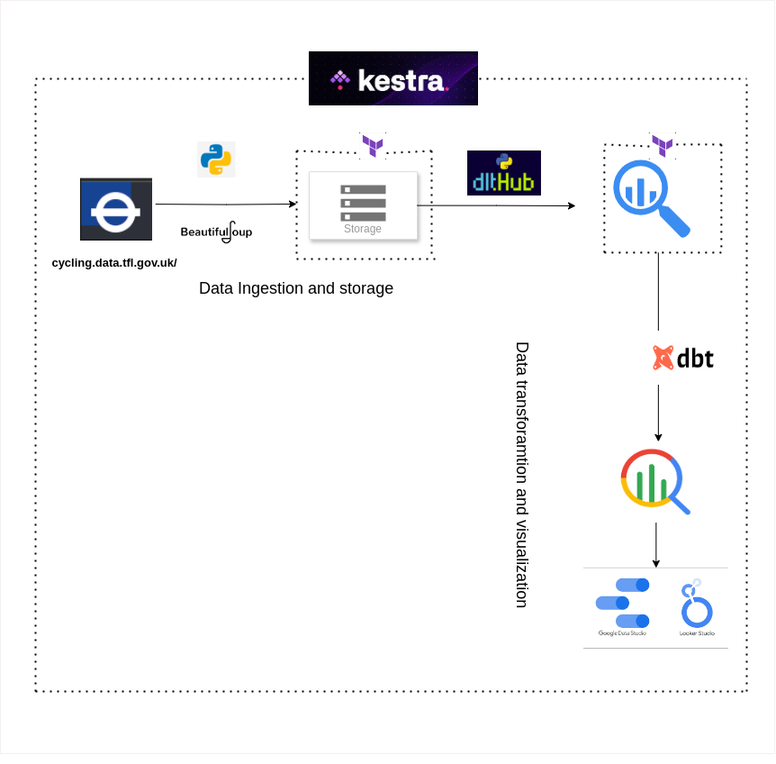

# London Cycling Active Travel Insights Data Pipeline

## Table of Contents
1. [Project Overview](#project-overview)
2. [Problem Statement](#problem-statement)
3. [Objectives](#objectives)
4. [Technology Used](#technology-used)
5. [End-to-End Data Pipeline Architecture](#end-to-end-data-pipeline-architecture)
6. [Reproducibility: Steps to Run the Project](#reproducibility-steps-to-run-the-project)
7. [Challenges and Limitations](#challenges-and-limitations)
8. [Future Work](#future-work)

---

## Project Overview
This project is a capstone for a data engineering training course, aimed at building an end-to-end data pipeline to provide insights into cycling patterns in London. The pipeline processes cycling data to help stakeholders understand active travel trends, such as how cycling activity varies by location, time, weather, and other factors.

---

## Problem Statement
Urban planners and policymakers in London lack actionable insights into cycling patterns due to unprocessed and fragmented data. This project addresses this gap by building a data pipeline to transform raw cycling data into an analytics-ready format and provides a dashboard to visualize trends, enabling data-driven decisions for sustainable urban planning.

---

## Objectives
- **Analyze Cycling Patterns**: Understand how factors like weather, time of day, and location impact cycling activity in London.
- **Identify High-Traffic Areas**: Highlight locations with high cycling activity to guide infrastructure improvements.
- **Promote Active Travel**: Provide data-driven insights to encourage cycling as a sustainable mode of transport.
- **Visualize Trends**: Build a dashboard to display categorical distributions (e.g., cycling counts by borough) and temporal trends (e.g., cycling activity over time).

**Intended Audience**: Urban planners, policymakers, and researchers focused on sustainable urban planning and active travel initiatives in London.

---

## Technology Used
- **BeautifulSoup**: Web scraping tool for extracting cycling data.
- **Google Cloud Storage (GCS)**: Data lake for storing raw CSV files.
- **DLT (Data Loading Tool)**: Loads data from GCS into BigQuery.
- **Google BigQuery**: Data warehouse for efficient analytics.
- **dbt (Data Build Tool)**: Transforms raw data into analytics-ready tables.
- **Terraform**: Manages GCP resources like GCS buckets and BigQuery datasets.
- **Kestra**: Orchestrates pipeline workflows.
- **Google Looker Studio**: Visualizes insights through dashboards.

---


The pipeline processes data from the source website to the final dashboard. Below is the architecture diagram:


### Key Components:
1. **Data Ingestion**:
    - Scrape cycling data using BeautifulSoup.
    - Store raw data in GCS.
    - Load data into BigQuery using DLT.

2. **Data Transformation**:
    - Use dbt to create staging and core models for analytics.

3. **Orchestration**:
    - Automate pipeline steps using Kestra.

4. **Visualization**:
    - Build dashboards in Google Looker Studio.

---

## Reproducibility: Steps to Run the Project

### Prerequisites
- **GCP Account**: Set up a project and service account with necessary roles.
- **Python 3.12.3+**: Install required libraries.
- **dbt**: Install dbt-core and dbt-bigquery.
- **Kestra**: Install and configure.

### Steps
1. **Set Up GCP**:
    - Use Terraform to create GCS buckets and BigQuery datasets.
    ```bash
    cd terraform
    terraform init
    terraform apply
    ```

2. **Data Ingestion**:
    - Activate virtual environment and run the web scraping script.
    - Load data into GCS and BigQuery using DLT.

3. **Data Transformation**:
    - Run dbt models to transform data.
    ```bash
    cd dbt/london_cycle_dbt
    dbt run
    ```

4. **Orchestration**:
    - Configure Kestra workflows to automate pipeline steps.

5. **Visualization**:
    - Build dashboards in Google Looker Studio using the transformed data.

---

## Challenges and Limitations
- **Data Quality**: Potential inconsistencies in scraped data.
- **Real-Time Data**: Currently uses batch processing; real-time streaming could improve insights.
- **Orchestration**: Kestra implementation is in progress; manual execution is used temporarily.

---

## Future Work
- Complete Kestra implementation for full pipeline automation.
- Build a comprehensive dashboard in Google Looker Studio.
- Add data quality tests using dbt.
- Set up CI/CD pipelines for automated testing and deployment.

